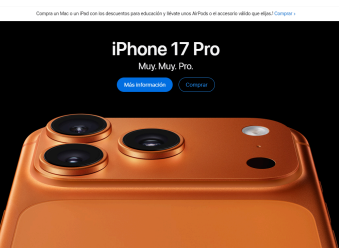
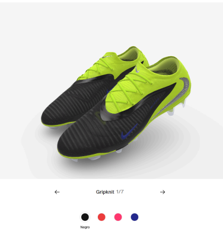
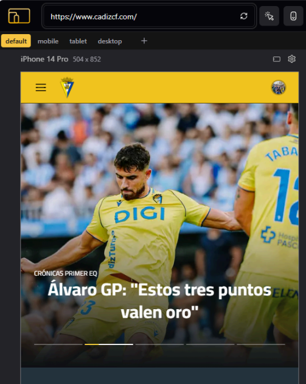
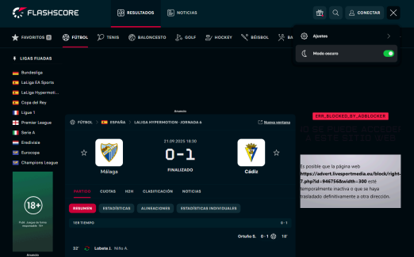
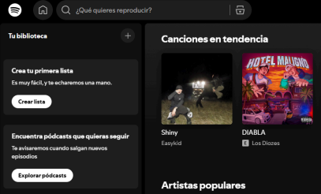
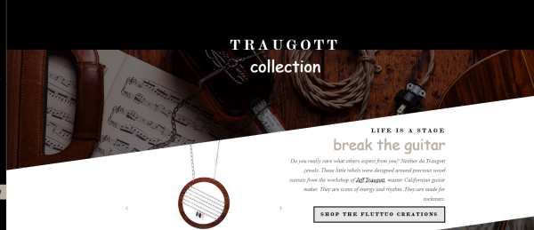

# 💻 Análisis de Tendencias y Características del Diseño Web Moderno

Este documento presenta una descripción técnica de las características de diseño web actuales, junto con ejemplos prácticos y una justificación sobre la tendencia del diseño de logotipos.

***

## 1. Características Clave del Diseño Web Actual

### A. Tipografía y Jerarquía Visual

| Característica | Descripción Técnica | Enfoque |
| :--- | :--- | :--- |
| **Fuentes y Títulos** | Utilización de **tipografías amplias y distintivas** para captar la atención. La tendencia prioriza la simplicidad y claridad tipográfica para **maximizar la legibilidad (UX)** en entornos web. | Impacto Visual y Legibilidad. |

### B. Interacción y Experiencia de Usuario (UX)

| Característica | Descripción Técnica | Enfoque |
| :--- | :--- | :--- |
| **Microinteracciones** | Pequeñas **animaciones o *feedback* visual** que reaccionan a las acciones directas del usuario (ej. `hover`, `click`). Mejoran la fluidez percibida y la interactividad de la interfaz. | Fluidez de la Interfaz. |
| **Búsqueda y Navegación por Voz** | Integración de *APIs* de reconocimiento de voz para ofrecer una **interacción más natural e intuitiva** con el sitio web, mejorando la accesibilidad. | Interacción Natural. |
| **Modo Oscuro** | Opción de interfaz que emplea **fondos oscuros y textos claros** (bajo contraste negativo). Su principal objetivo es reducir la **fatiga visual** en entornos de baja luminosidad. | Ergonomía Visual. |

### C. Inmersión y Tecnologías Gráficas

| Característica | Descripción Técnica | Enfoque |
| :--- | :--- | :--- |
| **WebXR (AR y VR) y WebGL** | Integración de **Realidad Aumentada (AR)** y **Realidad Virtual (VR)** para generar experiencias **inmersivas** (ej. visualización 3D de productos). **WebGL** permite el *rendering* de gráficos 2D/3D de alto rendimiento directamente en el navegador sin *plugins*. | Experiencias Inmersivas. |
| **Gráficos Vectoriales** | Uso preferente de formatos como **SVG** (Scalable Vector Graphics) sobre mapas de bits. La principal ventaja es el **escalado sin pérdida de calidad** (*resolution independence*). | Escalabilidad y Calidad. |

### D. Rendimiento y Arquitectura Web

| Característica | Descripción Técnica | Enfoque |
| :--- | :--- | :--- |
| **WebAssembly (Wasm)** | Estándar que permite ejecutar código de bajo nivel (ej. C, C++, Rust) con **rendimiento cercano al nativo** en el navegador. Ideal para **aplicaciones web complejas, juegos** y tareas de alta computación. | Alto Rendimiento. |
| **Aplicaciones Web Progresivas (PWA)** | Sitios web construidos con *Service Workers* y manifiestos que replican la **experiencia de una aplicación nativa** (rapidez, trabajo *offline*, notificaciones *push*). | Accesibilidad y Rendimiento. |
| **SPA (Single-Page Applications)** | Modelo arquitectónico donde la aplicación **carga todo el contenido en una única carga inicial**. Las transiciones subsiguientes solo reescriben partes del DOM, resultando en una experiencia **más rápida y fluida**. | Eficiencia de Carga. |
| **Frameworks JS y CSS** | Uso de librerías y *frameworks* de desarrollo (ej. **React, Angular, Vue, Bootstrap**) para **acelerar el desarrollo**, asegurar una **estructura coherente** y aplicar patrones de diseño probados. | Desarrollo Rápido y Coherente. |

### E. Estilos y Estética

| Característica | Descripción Técnica | Enfoque |
| :--- | :--- | :--- |
| **Degradados** | Aplicación sutil y compleja de transiciones de color (*gradients*) para generar una **sensación moderna, dinámica** y de profundidad. | Estética Moderna. |
| **Neomorfismo y Minimalismo** | Estética centrada en la **simplicidad, formas geométricas y colores puros**. El **Minimalismo** prioriza lo limpio y ordenado, mientras que el **Neomorfismo** (variante) añade un estilo que simula elementos 3D a partir de sombras suaves. | Claridad y Orden. |

### F. Adaptabilidad y Personalización

| Característica | Descripción Técnica | Enfoque |
| :--- | :--- | :--- |
| **Diseño Responsive** | Principio de diseño que asegura que la interfaz se **adapte y funcione de manera óptima** en **cualquier tamaño de pantalla o dispositivo** (móvil, tablet, escritorio), fundamental para la accesibilidad. | Universalidad y Accesibilidad. |
| **Inteligencia Artificial (IA)** | Uso de algoritmos de *Machine Learning* para **personalizar la experiencia del usuario**, desde recomendaciones de contenido hasta **interfaces dinámicamente adaptables** a las necesidades individuales. | Personalización y Relevancia. |
| **Scrolling Design** | Diseño que utiliza el desplazamiento de la página de forma creativa para la **narrativa visual** o la **guía del usuario**. | Narrativa Visual. |
| **Scroll Infinito** | Técnica de carga continua de contenido a medida que el usuario se desplaza hacia abajo, **eliminando la paginación**. | Retención de Usuario. |
| **Efecto Parallax** | El fondo de la página se mueve a una **velocidad diferente** a la del primer plano, creando una **ilusión de profundidad** (3D) y dinamismo. | Profundidad Visual. |

***

## 2. Ejemplos de Implementación Práctica con Referencias Visuales

| Característica | Ejemplo Práctico | Contexto de Uso | Referencia Visual |
| :--- | :--- | :--- | :--- |
| **Fuentes Grandes** | El sitio web de **Apple** utiliza tipografías amplias y limpias para titulares de productos, logrando un **impacto visual fuerte** y directo. | *Marketing* y *Branding*. | **** |
| **Microinteracciones** | El **cambio de color de un icono de "Me Gusta"** al hacer clic. Ejemplo complejo: personalización de zapatillas en 3D en el sitio web de Nike. | *Feedback* al Usuario. | **** |
| **Diseño Responsive** | Sitios como **Airbnb** o el sitio web del **Cádiz CF** cuya interfaz se ajusta óptimamente al dispositivo (móvil, tablet, escritorio). | Accesibilidad Universal. | **** |
| **Modo Oscuro** | Plataformas como **Flashscore** ofrecen la opción de cambiar el tema a oscuro para una visualización **más cómoda en baja luz**. | Ergonomía de Uso. | **** |
| **PWA** | La versión web de **Spotify** funciona como una aplicación (acceso rápido, rendimiento) sin requerir descarga desde una tienda de aplicaciones. | Experiencia de Aplicación. | **** |
| **Efecto Parallax** | Webs como **Fluttuo** lo implementan para crear una **sensación de profundidad** y un recorrido visual dinámico al hacer *scroll*. | Narrativa Visual. | **** |

***

## 3. Justificación de la Tendencia de Logos Planos

La evolución hacia **logotipos planos (Flat Design)** y minimalistas se debe principalmente a la convergencia de la **evolución tecnológica** y los **nuevos hábitos de consumo de contenido digital**.

### Factores Determinantes:

1.  **Adaptación a Múltiples Pantallas (Responsive Design):**
    * Los logos planos son más **versátiles** y se escalan de manera eficiente en una amplia gama de dispositivos, desde pantallas 4K hasta *smartwatches*.
    * La **eliminación de sombras, degradados complejos y efectos 3D** garantiza que el logotipo mantenga su **legibilidad** y reconocimiento en cualquier tamaño y resolución.

2.  **Simplicidad y Reconocimiento Instantáneo:**
    * Al ser visualmente más simples y libres de elementos innecesarios, son **más sencillos de recordar** y de reconocer al instante (alta **recordabilidad**).
    * Su diseño limpio y directo **comunica la marca de manera más efectiva** al reducir el ruido visual.

3.  **Coherencia e Identidad de Marca (Branding):**
    * La simplicidad del diseño plano facilita el mantenimiento de una **identidad visual consistente** (*cross-platform*) a través de todas las aplicaciones digitales y físicas de la marca.

**Ejemplo:** El logo de **Movistar** es un ejemplo claro de diseño plano que prioriza la funcionalidad y el reconocimiento inmediato en entornos digitales.
---