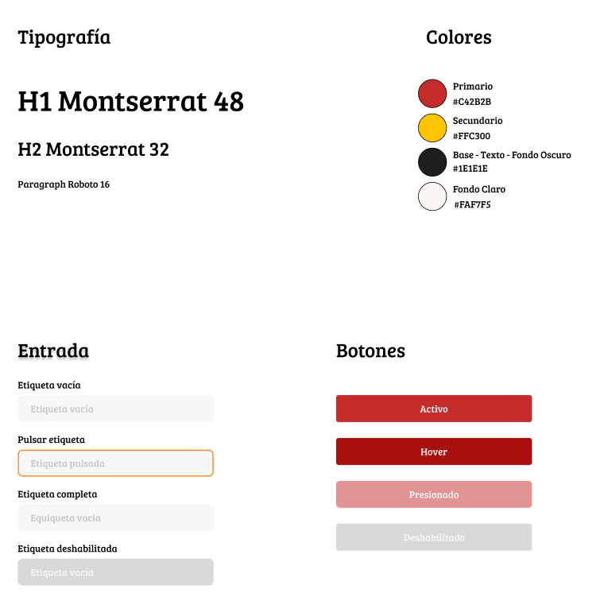

# Guía de Estilo para la Interfaz Web de un Restaurante Fast Food

Una guía de estilo concisa y energética para diseñar una experiencia de pedido online **rápida, moderna** y que despierte el **apetito**.

---

## 1. Definición de la Identidad del Proyecto

| Aspecto | Definición Clave |
| :--- | :--- |
| **Tipo de Negocio** | Restaurante de **comida rápida** (Fast Food): Hamburguesas, patatas y batidos. Énfasis en **rapidez** y facilidad de pedido online/recogida. |
| **Valores a Transmitir** | Rápido, **Moderno**, Energético, Amigable y de **Alta Calidad** (a pesar de la velocidad). |
| **Público Objetivo** | **Jóvenes**, **Familias jóvenes** y **Oficinistas/Estudiantes** que buscan opciones rápidas y accesibles. |

---

## 2. Paleta de Colores Corporativos

Buscamos transmitir **Energía** y **Apetito** (rojo, amarillo), combinados con **Confianza** y **Calidad** (negro, blanco).

| Color | Código Hex | Propósito y Emoción |
| :--- | :--- | :--- |
| **Principal (Acento/CTA)** | **`#C42B2B`** | **Rojo Ladrillo Intenso** - Atención, Urgencia y un toque diferenciador. |
| **Secundario (Marca/Energía)** | **`#FFC300`** | **Amarillo Mostaza Vibrante** - Resalte, Sabor y Energía. |
| **Base (Texto/Fondo Oscuro)** | **`#1E1E1E`** | **Negro Carbón** - Modernidad, contraste y fuerza. |
| **Fondo Claro** | **`#FFFFFF`** o `#FAF7F5` | **Blanco Puro** o **Crema Suave** - Limpieza y legibilidad. |

**Comportamiento del Color:**
* **Fondo Claro:** Rojo Ladrillo y Amarillo Mostaza para marca y acentos.
* **Fondo Oscuro (Negro Carbón):** Blanco y Amarillo Mostaza para textos principales, y **Rojo Ladrillo** para las **Llamadas a la Acción (CTA)**.

---

## 3. Tipografía: Velocidad y Legibilidad

Se prioriza una fuente **sans-serif** moderna y clara que evoque velocidad.

| Elemento | Fuente y Estilo | Uso Principal |
| :--- | :--- | :--- |
| **H1** | **Montserrat ExtraBold** | Títulos principales de página. |
| **H2** | **Montserrat Bold** | Secciones de menú y subtítulos importantes. |
| **Cuerpo de Texto** | **Roboto Regular/Medium** | Descripciones de productos y texto general (alta legibilidad digital). |

### Jerarquía y Tamaños

| Pantalla | H1 | H2 | Cuerpo |
| :--- | :--- | :--- | :--- |
| **Web (Escritorio)** | 48px | 32px | 16px |
| **Móvil** | 32px | 24px | 14px |

***Nota:*** *El peso **Bold (Negrita)** en Roboto se usará estratégicamente para destacar precios y elementos de menú clave.*

---

## 4. Iconografía y Elementos Gráficos

### Iconografía
* **Estilo:** Iconos de **línea rellena** (*filled line icons*) con esquinas ligeramente redondeadas.
* **Uso:** Sencillez y reconocimiento universal (Carrito, Menú/Hamburguesa, Ubicación).

### Ilustraciones y Fotografía
* **Base:** **Fotografía Real** de alta calidad de la comida (primeros planos vibrantes y saturados).
* **Ilustraciones:** Limitadas a estilos **minimalistas y planos** para representar servicios o beneficios ("Entrega Rápida").
* **Coherencia:** Iconos e ilustraciones usarán el **Amarillo Mostaza** y **Rojo Ladrillo** para detalles.

---

## 5. Botones y Llamadas a la Acción (CTA)

Los botones deben ser **visibles** y comunicar **urgencia** para la compra.

| Tipo de Botón | Diseño | Interacciones (Hover/Click) |
| :--- | :--- | :--- |
| **Principal (Compra)** | **Relleno completo en Rojo Ladrillo** con texto Blanco (**Montserrat Bold**). Esquinas ligeramente redondeadas (4px). | **Hover:** Se oscurece ligeramente y se eleva (**`box-shadow`**). |
| **Secundario (Informativo)** | Estilo **Ghost**, con contorno en Rojo Ladrillo y fondo transparente o Blanco. | **Click:** Reducción de escala para simular pulsación. |

***Posición Consistente:*** *El botón de **"Carrito de Compra"** se mantendrá fijo (flotante) en el margen inferior derecho en todas las páginas.*

---

## 6. Estilo de Imágenes

* **Prioridad:** **Fotografía Real** para el catálogo de productos.
* **Tratamiento Visual:**
    * No se aplicarán filtros que alteren los colores reales de los alimentos.
    * Alta saturación y contraste para maximizar el apetito.
    * Imágenes de producto con **bordes suaves (radio de 8px)** para un look moderno.
* **Integración:**
    * En **Cards** limpias con fondo Blanco.
    * Las imágenes grandes (*hero images*) usarán una **superposición oscura** para asegurar la legibilidad de los titulares.

---

## 7. Espaciado y Disposición (Layout)

Se implementará un sistema de diseño modular y flexible.

* **Escala de Espaciado:** Basada en **múltiplos de 8px** (8, 16, 24, 32, 48, 64px...).
* **Márgenes y Paddings:**
    * **Padding Vertical** entre secciones principales: **64px** (Web) / **40px** (Móvil).
    * **Padding Interno** en Cards: 16px.
* **Contenedores:**
    * Ancho máximo del contenedor principal: **1280px a 1440px**.
    * Cards de producto de ancho flexible, adaptándose a **3 o 4 columnas** en escritorio.
* **Consistencia:** Asegurada mediante **Grids flexibles** y **Media Queries**.

---

## 8. Normas de Interacción y Usabilidad

| Elemento | Estilo y Comportamiento |
| :--- | :--- |
| **Mensaje de Error** | **Fondo Rojo** y texto Blanco con icono de exclamación. Desaparece en 3s. |
| **Mensaje de Éxito** | **Fondo Verde (`#4CAF50`)** y texto Blanco con icono de check. Desaparece en 3s. |
| **Navegación Web** | Barra superior **Sticky** con un CTA principal ("Pide Ahora") siempre visible. |
| **Navegación Móvil** | **Barra inferior fija** con iconos clave (Menú, Carrito) para acceso con el pulgar. |
| **Formularios** | Borde del campo de texto resaltado con **Amarillo Mostaza** al estar en foco (`focus`). |
| **Menú Móvil** | Desplegable de **Menú de Hamburguesa** que cubre lateralmente la pantalla. |

---

## 9. Guía de estilos en formato visual

Esta es la guia de estilos en formato visula (**Realizado en Figma**).

****
