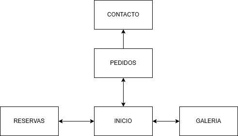
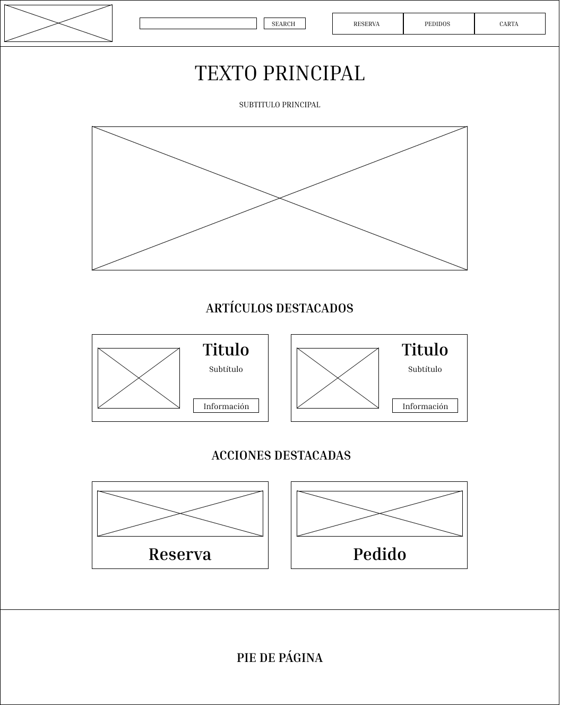
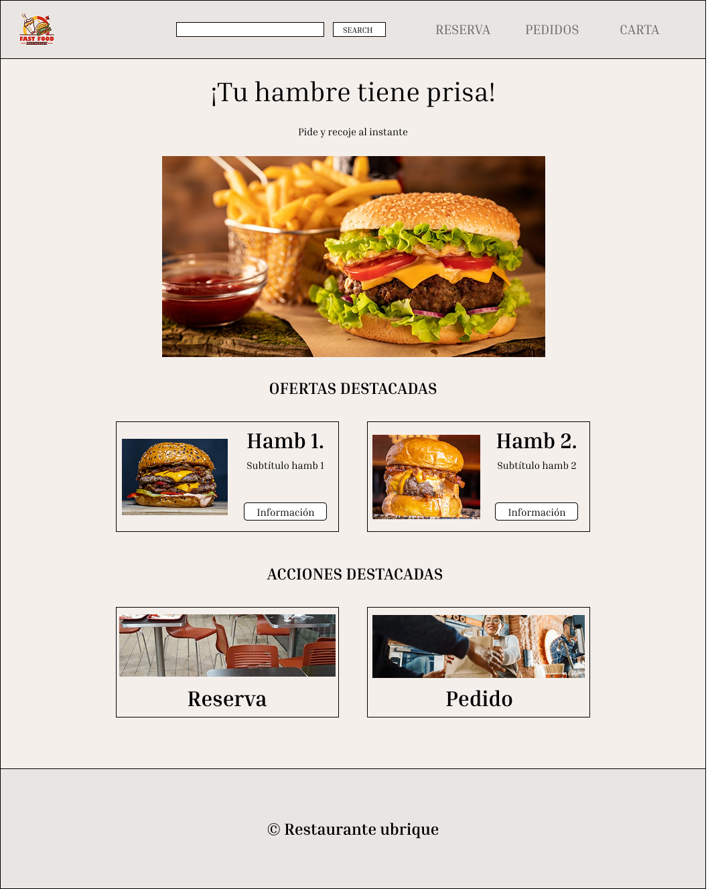

# 🗺️ Diseño de web de Ubrique

Este documento detalla la realización del diagrama de navegación y distintos diseños (Sketch, Wireframe, Mockup y Prototipo) de una web de comida rápida de Ubrique.

***

## 1. Diagrama de navegación

Realizado con Diagrams.io y representa la navegación entre páginas de mi web.

****

***

## 2. Sketch

Realizado a papel y boli y recoje un boceto rápido de como quiero que sea la web.

****

***

## 3. Wireframe

Realizado con figma y ya forma lo que va a ser la web sin colores, ni estilos, ni texo.

****

***

## 4. Mockup

Realizado con figma y ya da algo de estilos, texto y reprenta casi la web completa a falta de detalles.

****

***

## 5. Prototipo

Realizado con figma y ya forma la web completa aplicando la navegación y los estilos de la guia realizada anteriormente.

****

---